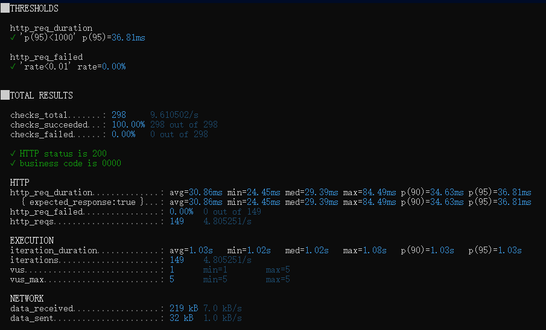
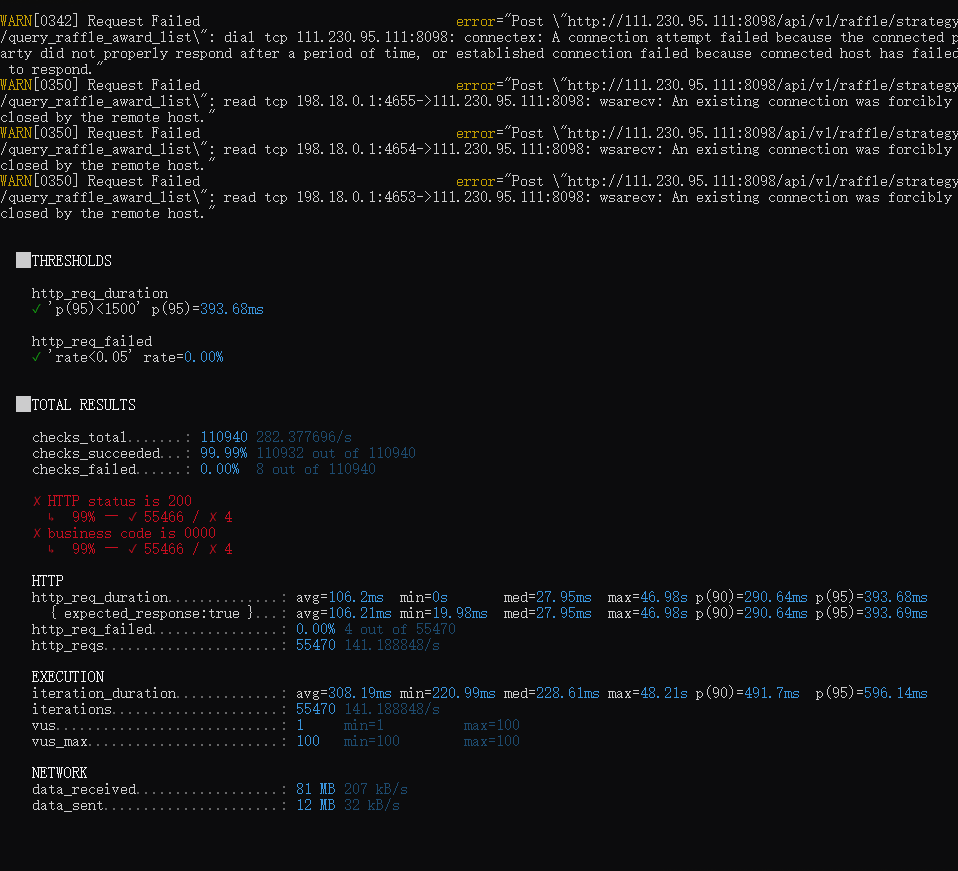
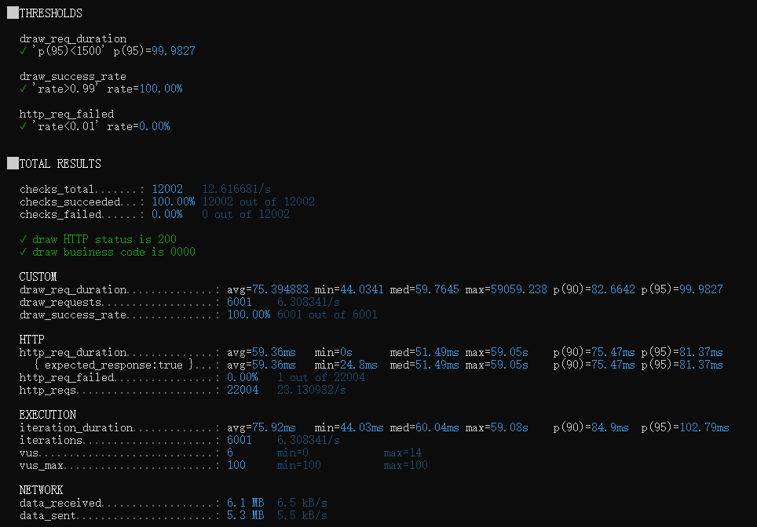
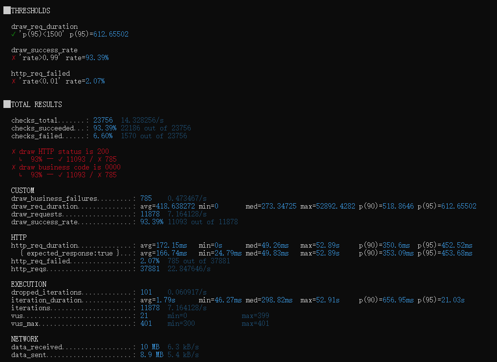
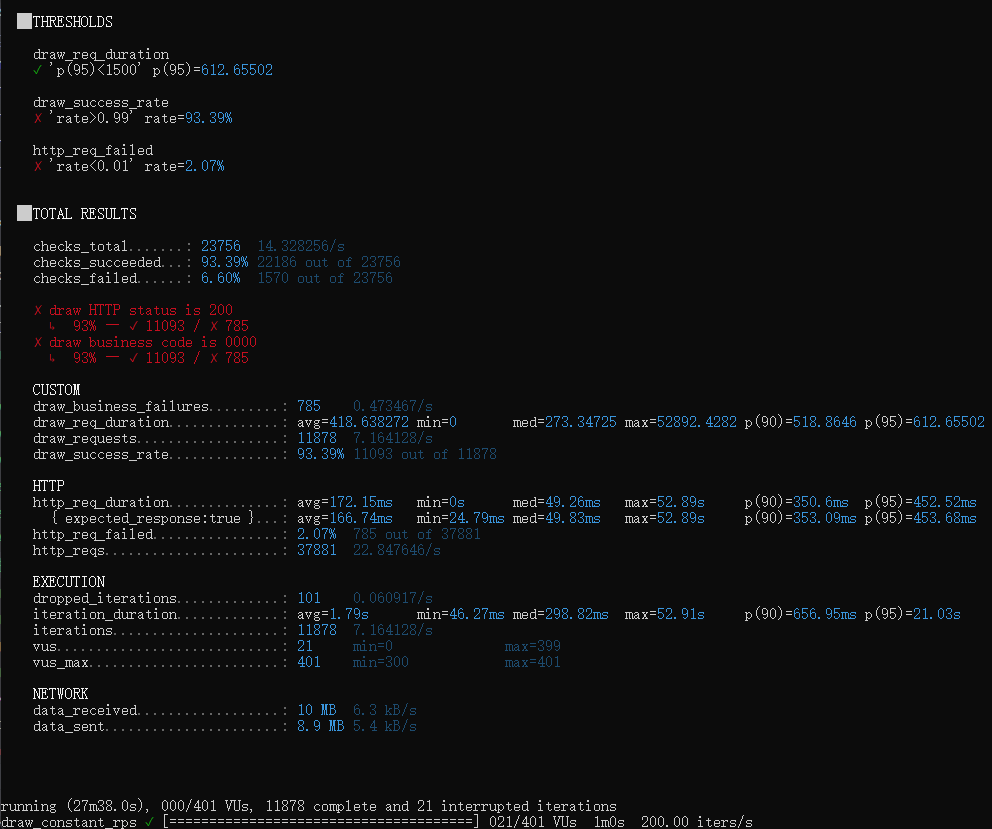
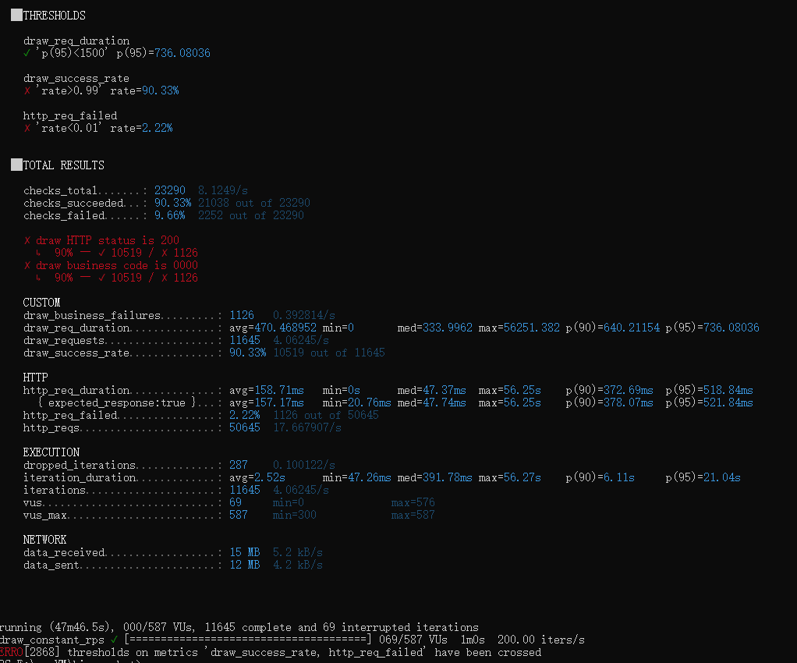

# 大营销平台压测报告

## 1. 结论摘要

本轮压测已经完成。测试覆盖了查询接口、抽奖链路冒烟验证、抽奖接口突发压测、抽奖接口恒定 RPS 压测，以及测试数据异常排查。

在当前环境下，核心结论如下：

| 项目 | 结论 |
| --- | --- |
| 查询接口稳定性 | 100 VU 阶梯压测下可达到约 141 RPS，HTTP 失败率约 0.007%，p95 约 393ms |
| 抽奖接口稳定吞吐 | 100 RPS 稳定通过，业务成功率 100%，draw p95 约 100ms |
| 抽奖接口不稳定区间 | 150 RPS 开始明显不稳定，业务成功率约 90.30%，HTTP 失败率约 2.64% |
| 200 RPS 结果 | 未通过，业务成功率约 90.33%，HTTP 失败率约 2.22%，存在连接失败和请求掉队 |
| 当前稳定结论 | 当前部署环境下，draw 抽奖接口稳定承载能力按 100 RPS 记录；瓶颈区间位于 100-150 RPS |

本轮压测采用的通过标准为：

| 指标 | 通过标准 |
| --- | --- |
| 业务成功率 | `draw_success_rate >= 99%` |
| HTTP 失败率 | `http_req_failed < 1%` |
| 响应时间 | `draw_req_duration p95 < 1500ms` |

按照以上标准，100 RPS 通过，150 RPS 和 200 RPS 均未通过。因此，本轮压测可以结束，当前可交付结论为：

```text
在 4C4G 云服务器 Docker Compose Lite 环境下，大营销平台 draw 抽奖接口可稳定承载约 100 RPS；提升到 150 RPS 后开始出现明显连接失败和业务成功率下降，200 RPS 档位未通过。当前环境的稳定承载上限建议按 100 RPS 记录，瓶颈区间位于 100-150 RPS。
```

## 2. 压测环境

| 项目 | 配置 |
| --- | --- |
| 压测工具 | k6 v1.6.1 |
| 压测机 | 本地 Windows 电脑 |
| 被测服务器 | 腾讯云 Ubuntu 22.04 |
| 服务器规格 | 4C4G |
| 部署方式 | Docker Compose Lite |
| 前端地址 | `http://111.230.95.111:3000` |
| 后端地址 | `http://111.230.95.111:8098` |

Docker Lite 版服务：

| 服务 | 作用 |
| --- | --- |
| front | 前端页面 |
| backend | Java 后端服务 |
| mysql | 业务数据存储 |
| redis | 库存扣减、缓存、分布式锁 |
| rabbitmq | 异步消息、积分与发奖链路 |
| nacos | 配置中心 |
| xxl-job-admin | 定时任务调度 |

压测链路：

```text
本地 k6 -> 公网 -> 腾讯云服务器 -> Docker backend -> MySQL / Redis / RabbitMQ
```

## 3. 指标说明

| 指标 | 含义 |
| --- | --- |
| VU | Virtual User，虚拟用户数，用于模拟并发用户 |
| RPS/QPS | 每秒请求数，用于衡量吞吐量 |
| p95 | 95% 请求的响应时间低于该值，比平均值更能反映大部分用户体验 |
| http_req_failed | HTTP 层失败率，例如连接失败、超时、服务端断开 |
| checks | k6 业务断言结果，例如 HTTP 状态是否为 200、业务 code 是否为 `0000` |
| draw_success_rate | 抽奖业务成功率，只有 HTTP 成功且业务 code 为 `0000` 才算成功 |
| dropped_iterations | k6 在恒定 RPS 模式下没来得及发出的请求数，出现该指标说明压力已经偏高 |
| interrupted iterations | 测试结束时仍未完成的请求数，通常说明存在长尾请求或连接阻塞 |

## 4. 查询接口压测结果

测试接口：

```text
POST /api/v1/raffle/strategy/query_raffle_award_list
```

查询接口冒烟验证截图：



测试脚本：

```text
performance/k6/query-load.js
```

测试方式：100 VU 阶梯压测。

| 指标 | 结果 |
| --- | ---: |
| 总请求数 | 55470 |
| 平均 RPS | 141.19/s |
| HTTP 失败数 | 4 |
| HTTP 失败率 | 约 0.007% |
| checks 成功率 | 99.99% |
| 平均响应时间 | 106.20ms |
| p90 | 290.64ms |
| p95 | 393.68ms |
| 最大响应时间 | 46.98s |

查询接口 100 VU 阶梯压测结果截图：



结论：查询接口在 100 VU 阶梯压测下整体稳定，HTTP 失败率极低，p95 低于 1500ms。本轮查询接口压测通过。

## 5. 抽奖接口压测方式

抽奖接口不是无状态查询接口。一次正常抽奖前，需要先准备用户抽奖次数，否则会出现“账户额度不足”类业务失败。

本轮压测使用的主要业务链路为：

```text
生成测试用户
-> 日历签到返利
-> 积分兑换 SKU 9901
-> 获得抽奖次数
-> 调用 draw 抽奖接口
```

涉及接口：

| 阶段 | 接口 |
| --- | --- |
| 签到返利 | `POST /api/v1/raffle/activity/calendar_sign_rebate` |
| 积分兑换抽奖次数 | `POST /api/v1/raffle/activity/credit_pay_exchange_sku` |
| 查询用户抽奖账户 | `POST /api/v1/raffle/activity/query_user_activity_account` |
| 抽奖 | `POST /api/v1/raffle/activity/draw` |

抽奖压测脚本：

| 脚本 | 作用 |
| --- | --- |
| `performance/k6/draw-smoke.js` | 小规模冒烟，验证完整链路是否跑通 |
| `performance/k6/draw-load.js` | 突发并发压测，观察多 VU 下链路表现 |
| `performance/k6/draw-rps.js` | 恒定 RPS 压测，用于判断稳定吞吐上限 |

## 6. 抽奖接口冒烟与突发压测

突发压测用于验证抽奖链路是否可用，不直接作为最终 QPS 结论。

| 档位 | USER_COUNT | DRAW_ITERATIONS | DRAW_VUS | 业务成功率 | draw 平均耗时 | draw p95 | 备注 |
| --- | ---: | ---: | ---: | ---: | ---: | ---: | --- |
| 小规模验证 | 20 | 20 | 5 | 100.00% | 103.44ms | 192.22ms | 链路跑通 |
| 中等并发 | 200 | 200 | 50 | 99.50% | 327.71ms | 496.39ms | 1 次业务失败 |
| 较高并发 | 500 | 500 | 100 | 99.80% | 722.33ms | 1032.28ms | 出现 1 次 draw timeout |

结论：抽奖链路本身可用；随着并发提高，响应时间明显上升，并开始出现长尾请求。

## 7. 抽奖接口恒定 RPS 压测

恒定 RPS 压测使用 `constant-arrival-rate` 模式，目标是固定每秒抽奖请求数，判断指定 RPS 下是否稳定。

测试脚本：

```text
performance/k6/draw-rps.js
```

### 7.1 通过档位

| 目标 RPS | 持续时间 | 实际 draw 请求数 | 业务成功率 | draw 平均耗时 | draw p90 | draw p95 | HTTP 失败 |
| ---: | --- | ---: | ---: | ---: | ---: | ---: | ---: |
| 50 | 1m | 3001 | 100.00% | 72.72ms | 60.75ms | 65.86ms | 0 |
| 100 | 1m | 6001 | 100.00% | 75.39ms | 82.66ms | 99.98ms | 1 次非 draw 阶段连接失败，draw 阶段 100% 成功 |

抽奖接口 100 RPS 稳定通过截图：



结论：50 RPS 和 100 RPS 均通过。100 RPS 是本轮压测确认的稳定档位。

### 7.2 未通过档位

| 目标 RPS | 持续时间 | 实际 draw 请求数 | 成功 draw 请求数 | 业务成功率 | draw 平均耗时 | draw p90 | draw p95 | HTTP 失败率 | dropped iterations | 结论 |
| ---: | --- | ---: | ---: | ---: | ---: | ---: | ---: | ---: | ---: | --- |
| 150 | 1m | 8981 | 8110 | 90.30% | 732.88ms | 656.34ms | 5001.06ms | 2.64% | 0 | 未通过 |
| 200 | 1m | 11645 | 10519 | 90.33% | 470.47ms | 640.21ms | 736.08ms | 2.22% | 287 | 未通过 |

高 RPS 失败过程截图：





200 RPS 关键输出：

```text
draw_success_rate = 90.33%
http_req_failed   = 2.22%
draw p95          = 736.08ms
dropped_iterations = 287
interrupted iterations = 69
```

200 RPS 最终复测截图：



150 RPS 和 200 RPS 均未达到通过标准。失败主要表现为连接级异常：

```text
EOF
request timeout
connectex: A connection attempt failed because the connected party did not properly respond
wsarecv: A connection attempt failed because the connected party did not properly respond
```

分析：

- 150 RPS 的业务成功率约 90.30%，HTTP 失败率约 2.64%，draw p95 达到约 5s，已经明显不稳定。
- 200 RPS 的业务成功率约 90.33%，HTTP 失败率约 2.22%，虽然 draw p95 未超过 1500ms，但连接失败和请求掉队明显。
- 200 RPS 出现 `dropped_iterations=287`，说明 k6 在该压力下已经无法完整按目标节奏发出全部请求。
- 两个高 RPS 档位的成功率都只有约 90%，不能作为稳定承载能力。

## 8. 测试数据问题与修复

压测过程中曾出现两类业务错误：

| 错误 | 含义 |
| --- | --- |
| `ERR_BIZ_006 账户总额度不足` | 测试用户没有可用抽奖次数，说明抽奖前置准备失败 |
| `ERR_BIZ_005 活动库存不足` | SKU 9901 抽奖次数商品库存不足，兑换抽奖次数失败 |

排查结果：

- `sku=9901` 是“抽奖次数商品”的库存，不是奖品库存。
- 前端用户能正常兑换，是因为真实用户消耗量小；压测批量生成大量用户，会集中消耗 SKU 9901。
- 兑换抽奖次数时，系统优先扣 Redis 中的 `activity_sku_stock_count_key_9901`。
- `armory` 预热逻辑只在 Redis key 不存在时写入，不会覆盖已有 Redis 库存值。
- 因此，当 Redis 中 SKU 9901 库存被压测消耗或污染后，即使 MySQL 看起来还有库存，兑换仍可能失败。

已执行处理：

```text
1. 恢复 MySQL 中 raffle_activity_sku 的 sku=9901 剩余库存。
2. 清理 Redis 中 activity_sku_stock_count_key_9901 及其相关库存锁 key。
3. 重新调用 armory 接口预热活动库存。
4. 使用小规模 RPS 测试验证用户准备链路恢复正常。
```

修复后验证：

| 验证项 | 结果 |
| --- | --- |
| readyUsers | 200 |
| requiredDraws | 50 |
| draw_success_rate | 100% |
| draw p95 | 约 97.90ms |
| HTTP 失败率 | 0% |

结论：库存问题已经修复，后续 200 RPS 失败不是因为“账户额度不足”或“SKU 库存不足”，而是高压下连接失败和请求掉队导致。

## 9. 服务器资源观察

压测期间观察到服务器内存可用量下降，但未确认发生 OOM。

典型资源状态：

| 服务 | 观察 |
| --- | --- |
| backend | 内存约 700MiB / 896MiB，接近 78% |
| mysql | 内存约 360MiB / 768MiB |
| redis | 内存占用较低 |
| rabbitmq | 内存约 120MiB / 512MiB |
| nacos | 内存占用较高，约 660MiB / 768MiB |
| 系统内存 | available 从 400MiB+ 下降到约 300MiB 左右 |

说明：

- Linux 会使用空闲内存做文件缓存，`free` 变低不一定代表内存泄漏。
- 但当前服务器没有 swap，且 Docker 容器总内存限制较紧，高压测试后 available 降低需要继续关注。
- 若后续继续压测，建议提前观察 `docker stats`、`free -h`、backend 日志和 MySQL 慢查询。

## 10. 最终结论

本轮压测可以结束。

最终结论如下：

| 结论项 | 结果 |
| --- | --- |
| 查询接口 | 100 VU 阶梯压测通过，约 141 RPS，p95 约 393ms |
| 抽奖接口稳定档位 | 100 RPS 通过，业务成功率 100%，p95 约 100ms |
| 抽奖接口失败档位 | 150 RPS、200 RPS 均未通过 |
| 当前稳定承载能力 | draw 抽奖接口按 100 RPS 记录 |
| 当前瓶颈区间 | 100-150 RPS |
| 主要失败形态 | 连接失败、超时、EOF、请求掉队 |
| 数据准备问题 | 已修复 SKU 9901 库存缓存问题 |

压测总结：

```text
使用 k6 对大营销平台核心抽奖链路进行压测。在 4C4G 腾讯云 Docker Compose Lite 环境下，查询接口 100 VU 阶梯压测可达到约 141 RPS；核心 draw 抽奖接口在 100 RPS 下保持 100% 业务成功率，p95 约 100ms。提升至 150 RPS 后开始出现连接失败和业务成功率下降，200 RPS 业务成功率约 90.33%，HTTP 失败率约 2.22%，综合判断当前环境稳定承载能力约为 100 RPS，瓶颈区间位于 100-150 RPS。
```

如果后续需要进一步提升性能，优先方向包括：

- 在服务器本机或同地域压测机补充压测，排除公网链路影响。
- 检查 Tomcat 连接数、线程池、请求队列和超时配置。
- 检查 Docker 容器内存限制，尤其是 backend、nacos、mysql。
- 增加 swap 或提升服务器内存，避免高压下系统可用内存过低。
- 分析 MySQL、Redis、RabbitMQ 在抽奖写链路中的耗时和队列积压。
